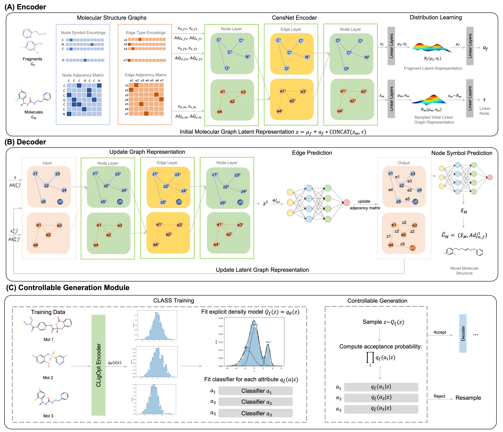

# CLigOpt-Controllable-Ligand-Design-through-Target-Specific-Optimisation
This repository contains the code of data preprocessing, model building, and model evaluation for [CLigOpt: Controllable Ligand Design through Target-Specific Optimisation](https://www.biorxiv.org/content/10.1101/2024.03.15.585255v2.full.pdf)


## Abstract
**Motivation**: Key challenge in deep generative models for molecular design is to navigate random sampling of the vast molecular space, and produce promising molecules that compromise property controls across multiple chemical criteria. Fragment-based drug design (FBDD), using fragments as starting points, is an effective way to constrain chemical space and improve generation of biologically active molecules. Furthermore, optimisation approaches are often implemented with generative models to search through chemical space, and identify promising samples which satisfy specific properties. Controllable FBDD has promising potential in efficient target-specific ligand design. 
**Results**: We propose a controllable FBDD model, CLigOpt, which can generate molecules with desired properties from a given fragment pair. CLigOpt is a Variational AutoEncoder-based model which utilises co-embeddings of node and edge features to fully mine information from molecular graphs, as well as a multi-objective Controllable Generation Module to generate molecules under property controls. CLigOpt achieves consistently strong performance in generating structurally and chemically valid molecules, as evaluated across six metrics. Applicability is illustrated through ligand candidates for hDHFR and it is shown that the proportion of feasible active molecules from the generated set is increased by 10%. Molecular docking and synthesisability prediction tasks are conducted to prioritise generated molecules to derive potential lead compounds.

## Requirements
The ZINC and CASF dataset can be downloaded at [here](https://github.com/oxpig/DeLinker).
The hDHFR dataset can be downloaded from [ChEMBL](https://www.ebi.ac.uk/chembl/target_report_card/CHEMBL202/)
This code was tested in Python 3.8. All requirements are provided and can be set up using conda.

## Cite us
Li, Yutong, et al. "CLigOpt: Controllable Ligand Design through Target-Specific Optimisation." bioRxiv (2024): 2024-03.

```
@article{li2024cligopt,
  title={CLigOpt: Controllable Ligand Design through Target-Specific Optimisation},
  author={Li, Yutong and Costa Avelar, Pedro Henrique da and Chen, Xinyue and Zhang, Li and Wu, Min and Tsoka, Sophia},
  journal={bioRxiv},
  pages={2024--03},
  year={2024},
  publisher={Cold Spring Harbor Laboratory}
}
```
